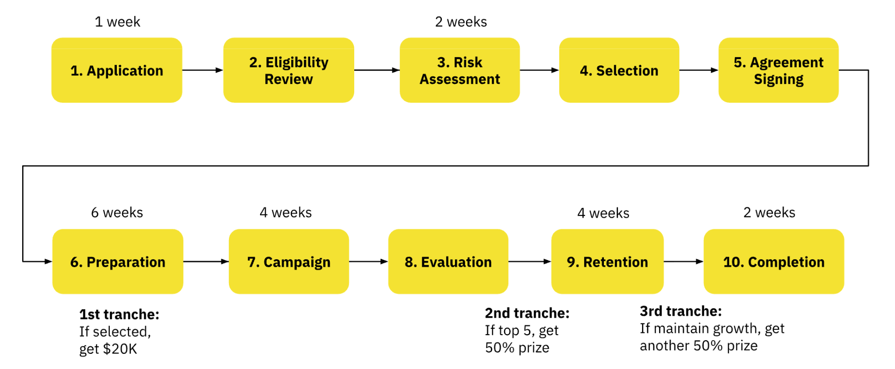
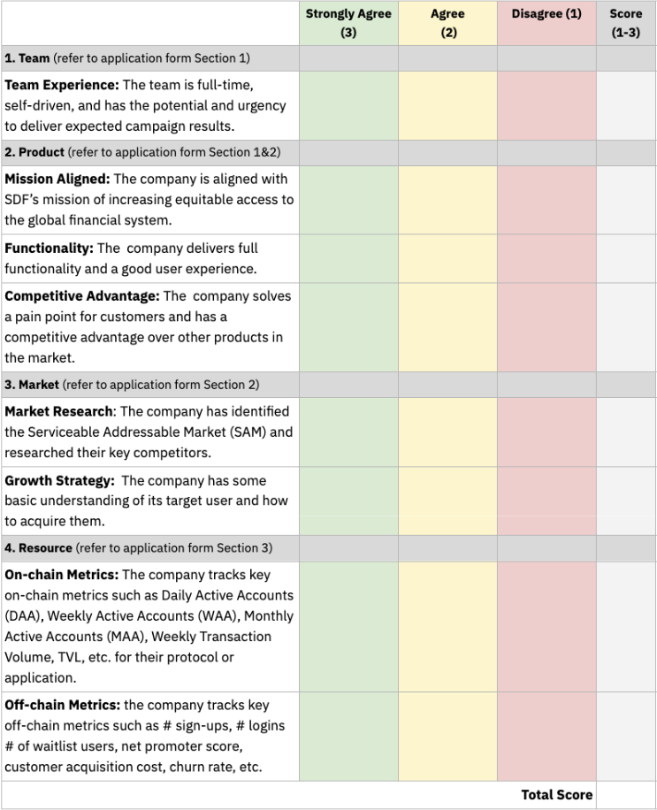
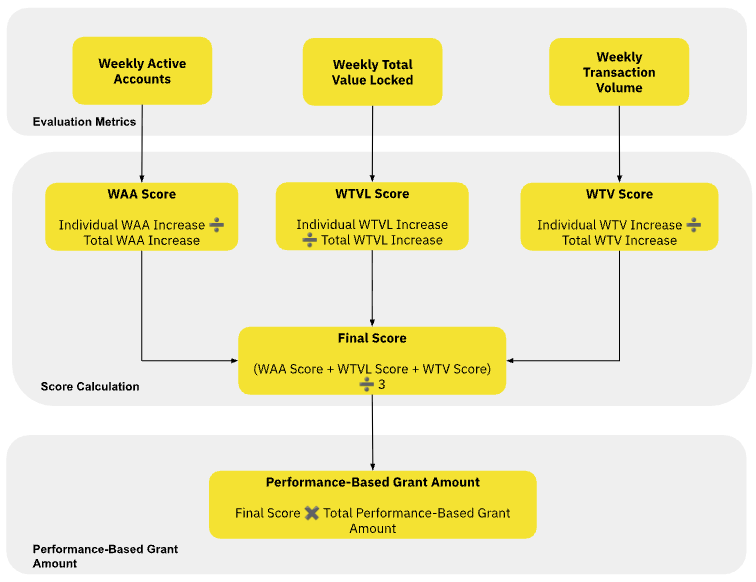

# Official Rules

The SCF Growth Hack is a program to support Stellar Mainnet-launched companies on go-to-market and finding product-market fit through competition-style user acquisition campaigns.&#x20;

For each cohort, the SCF Growth Hack program will target 10-15 companies that have launched on Stellar Mainnet, providing them with USD $20,000 worth of XLM each to test acquisition strategies over an 8-week campaign (comprising a 4-week acquisition campaign and a 4-week retention campaign).&#x20;

Top-performing companies will share up to USD $200K worth of XLM in additional performance-based awards. This program aims to help teams find PMF at an accelerated pace and serves as a bridge between development funding (SCF Build Award) and further growth (SDF Marketing Grant and Matching Fund Investment Readiness).

Each Project in the SCF Growth Hack needs to adhere to the [Participant Eligibility Rules](official-rules.md#eligibility-criteria), the [application-](official-rules.md#eligibility-criteria) and [evaluation criteria](official-rules.md#selection-criteria), as well as the [General Rules](official-rules.md#general-rules) (altogether known as “Official Rules”).

## Structure & Timeline

During the program, companies will follow the 10 stages below.

<figure><figcaption></figcaption></figure>

<table data-full-width="true"><thead><tr><th width="207.29296875">Phase</th><th>Description</th></tr></thead><tbody><tr><td>Application (1 week)</td><td>Eligible companies submit applications for the Growth Hack Program.</td></tr><tr><td>Selection &#x26; Risk Assessment (2 weeks)</td><td>SDF reviews applications against selection criteria. If you pass, you proceed; if not, SDF notifies you via email. SDF conducts risk assessment and KYC (if needed); may request additional info. If you pass, you’re approved and must sign SDF’s standard grant agreement. If you don’t pass, SDF notifies you via email.</td></tr><tr><td>1st Payment (post-agreement)</td><td>After the agreement is signed, SDF sends a small test transaction to the Stellar address/memo provided. You confirm the exact amount back to SDF. Once confirmed, SDF sends the full upfront award: <strong>USD $20K worth of XLM</strong>.</td></tr><tr><td>Preparation — Resource Mapping &#x26; Market Research (Weeks 1–2 of Prep)</td><td>SDF runs a series of workshops and introduces resources (agencies, contractors, GTM content, etc.). Each company explores options and decides whether to engage external support for research, strategy, and execution by end of Week 2.</td></tr><tr><td>Preparation — Strategy &#x26; Measurement (Weeks 3–4 of Prep)</td><td>Each project drafts its campaign plan (budget, incentives, channels, content, retention, measurement). SDF reviews and may amplify at its discretion. <strong>On-chain:</strong> build a Dune dashboard (shared with SDF &#x26; cohort) tracking WAA and txn volume vs. baseline. <strong>Off-chain:</strong> set up a dashboard on a preferred platform and share access with SDF. Weekly metric updates during the competition.</td></tr><tr><td>Preparation — Pre-launch Testing &#x26; Improvement (Weeks 5–6 of Prep)</td><td>Run closed beta groups; collect and apply feedback to product and strategy. Submit a final campaign plan form to SDF covering: target market/audience; acquisition channels; activity/timeline; KPIs (CPA, conversion, etc.); team capacity/expertise.</td></tr><tr><td>Campaign (4 weeks)</td><td>Execute the campaign and track growth metrics for 4 weeks. Document activities, conversion rates, and challenges. SDF holds a 15-minute weekly check-in to review progress and give feedback as needed.</td></tr><tr><td>Evaluation</td><td>After activation ends, SDF reviews results, announces the performance-based award pool, and names the <strong>top 5</strong> winners. Evidence of prohibited market manipulation leads to disqualification.</td></tr><tr><td>2nd Payment (top 5 only)</td><td>The top 5 companies receive the <strong>first 50% of their performance-based award</strong>.</td></tr><tr><td>Retention (4 weeks)</td><td>Use funding to sustain growth for 4 additional weeks. Maintain dashboards and report to SDF <strong>bi-weekly</strong>.</td></tr><tr><td>3rd Payment (conditional)</td><td>If average WAA and weekly txn volume remain within <strong>30% of competition levels</strong> (i.e., <strong>≤70% decline</strong>) during the 4-week retention period, the <strong>final 50% of the performance-based award</strong> is paid. If metrics drop by <strong>>70%</strong>, no third tranche is distributed.</td></tr><tr><td>Completion</td><td>Submit a final report summarizing strategies, acquisition results, and lessons learned.</td></tr></tbody></table>

## Eligibility Criteria&#x20;

Companies applying to the Growth Hack Program must meet the following criteria:

* The company must be a financial protocol or application live on Stellar Mainnet.
* The company must have completed KYC and sanctions screening from the Stellar Development Foundation within the past two years.
* The company must not have other active grants from the Stellar Development Foundation.
* If the company is a financial protocol, the Project must have completed at least one security audit with any identified vulnerabilities fixed.
* If using Soroban, participating companies should use SAC tokens.

## Selection Criteria

Companies should demonstrate a good fit and readiness for the Growth Hack Program, and have the basic capabilities and resources necessary for execution.

<figure><figcaption></figcaption></figure>

## Award Structure

Each selected project will be awarded USD $20K worth of XLM\* Upfront campaign awards to build a user acquisition strategy. The top 5 companies based on the selection metrics will be further awarded performance-based awards of up to $200K in XLM\*.

<table data-full-width="true"><thead><tr><th>Awards</th><th>Amount</th></tr></thead><tbody><tr><td>Upfront campaign awards</td><td>$20K in XLM*</td></tr><tr><td>Performance-based awards</td><td>$50K or $100K or $200K in XLM*</td></tr><tr><td>Total</td><td>$70K - $220K in XLM*</td></tr></tbody></table>

### Performance-based Awards&#x20;

The Performance-based awards are dynamic, depending on the Total Weekly Active Accounts of all companies measured at campaign start and end. The top 5 companies based on the three selection metrics will share the awards.

<table data-full-width="true"><thead><tr><th>Award Size Level</th><th>Total WAA for all participating companies</th><th>Total Awards</th></tr></thead><tbody><tr><td>Level 1 </td><td>&#x3C; 1.5X Baseline* </td><td>$50,000 in XLM**</td></tr><tr><td>Level 2</td><td>
> 1.5X Baseline

&#x3C; 3X Baseline
</td><td>$100,000 in XLM**</td></tr><tr><td>Level 3 </td><td>> 3X Baseline</td><td>$200,000 in XLM**</td></tr></tbody></table>

### Top 5 Projects Selection

Top projects will be selected based on the three metrics below:

<table data-full-width="true"><thead><tr><th width="256.92578125">Metric</th><th>Description</th></tr></thead><tbody><tr><td>Weekly Active Accounts (WAA) Increase</td><td>WAA Increase = Average WAA during the campaign - Average WAA before the campaign. The average WAA is the sum of WAAs for each week during the 4-week campaign period, divided by 4. An active account means the account that initiated at least one operation.</td></tr><tr><td>Weekly Transaction Volume Increase</td><td>Weekly Transaction Volume Increase = Average Weekly Transaction Volume during the campaign - Average Weekly Transaction Volume before the campaign</td></tr><tr><td>Weekly Total Value Locked (TVL) Increase</td><td>WTVL Increase = Average TVL during the campaign - Average TVL before the campaign</td></tr></tbody></table>

### Award Calculation

Top Projects qualify to receive a performance-based Grant amount split 50/50 over the course of Tranches 2 and 3. The amount attributed to a Top Project is calculated by the sum of such Top Project’s WAA Increase divided by the total WAA Increase across all Participating Projects, the Top Project’s WTV Increase divided by the total WTV Increase across all Participating Projects, the Top Project’s WTVL Increase divided by the total WTVL Increase across all Participating Projects during the Activation Stage(s), divided by 3 and multiplied by the applicable Total Grant Amount, (the "Individual Grant”). The following is an example of Awards calculation for Top Projects:

$$
IndividualGrant = ((X)/∑(X) +(Y)/∑(Y) +(Z)/∑(Z)) /3 * A
$$

_X = WAA Increase, Y = Weekly Txn Volume Increase, Z = Weekly TVL increase, A = Total Grant Amount_

<figure><figcaption></figcaption></figure>

### Example of Performance-Based Grant Calculation

To help understand how the calculation outlined above works, please see an example below where the Total WAA for all Participating Projects reaches a Level 2 Pool Size, which increases the Grant Pool to $100,000 in XLM. In this example, the Top Projects will qualify for the following:

<table data-full-width="true"><thead><tr><th>Project</th><th width="222.6875">WAA Increase (X)</th><th width="186.62890625">WTV Increase (Y)</th><th width="208.1796875">WTVL Increase (Z)</th><th width="429.53125">Individual Award = (X)/∑(X) +(Y)/∑(Y)]/2 * Z (USD value, paid in XLM)</th><th>Rank</th></tr></thead><tbody><tr><td>Project A</td><td>1,500</td><td>$35,000</td><td>$7,000</td><td>(0.15+0.35+0.7)/3*$100K = $40K</td><td>1</td></tr><tr><td>Project B</td><td>5,000</td><td>$40,000</td><td>0</td><td>(0.5+0.4+0)/3*$100K = $30K</td><td>2</td></tr><tr><td>Project C</td><td>1,000</td><td>$5,000</td><td>0</td><td>(0.1+0.05+0)/3*$100K = $5K</td><td>5</td></tr><tr><td>Project D</td><td>2,000</td><td>$5,000</td><td>0</td><td>(0.2+0.05+0)/3*$100K = $8.33K</td><td>4</td></tr><tr><td>Project E</td><td>500</td><td>$15,000</td><td>$3,000</td><td>(0.05+0.15+0.3)/3*$100K = $16.67K</td><td>3</td></tr><tr><td>Total Increase</td><td>
10,000

∑(X)
</td><td>
$100,000

∑(Y)
</td><td>
$10,000

∑(Y)
</td><td>Total $100K (A=Level 2 Grant Pool)</td><td>-</td></tr></tbody></table>

### Award Distribution

For the top 5 companies, the award will be distributed in the following three payment tranches. The companies ranked 6 to 10 will only be awarded the upfront campaign awards.

<table data-full-width="true"><thead><tr><th>Payment Tranche</th><th width="211.44140625">Purpose</th><th>Total (USD value, paid in XLM)</th><th width="87.33203125"># of companies</th><th>Amount per Project</th></tr></thead><tbody><tr><td>1. Upfront campaign awards</td><td>Prepare the user acquisition campaign</td><td>$200K</td><td>10</td><td>$20K in XLM</td></tr><tr><td>2. Performance-based awards</td><td>Award the top 5 companies based on the 3 selection metrics</td><td>$100K max*</td><td>5</td><td>
1st half of 

Individual Award
</td></tr><tr><td>3. Performance-based awards</td><td>Award user retention >=30%</td><td>$100K max*</td><td>&#x3C;=5</td><td>
2nd half of 

Individual Award 
</td></tr></tbody></table>

_\*The dynamic awards amount is depending on the campaign performance._&#x20;



\*\*The dynamic awards amount is depending on the campaign performance.

## Use of Funds Guidance

When building your user acquisition plan, please keep in mind of the following rules:

### Allowed Uses

* **Onboarding Incentives:** Offer limited-time promotions in a compliant way, like sign-up bonuses or transaction fee discounts to attract new users.
* **Digital Advertising:** Utilize paid ads on social media platforms (Twitter, Discord, Telegram, LinkedIn) to attract new users.
* **Community Engagement:** Run community contests, AMAs, or referral programs in a compliant way to incentivize user participation and drive organic growth.
* **Influencer Partnerships:** Collaborate with influencers or ecosystem advocates in a compliant way to promote your project and increase user awareness.
* **Content Marketing:** Publish blogs, tutorials, or explainer videos to educate users on your project and its benefits, driving engagement.
* **Quest:** Provide rewards to users who have completed certain tasks on your application/protocol.
* **Airdrops:** offer airdrops to users demonstrating significant contribution, engagement, and interaction with your protocol/application and community.
* **Analytics & Optimization:** Use analytics tools to monitor campaign performance, optimize user acquisition strategies, and adjust spending for better results.
* **Contractor and Agency:** engage with external expertise to help you build the user acquisition strategy and execute it.

### Restricted Uses

* **Bot Traffic or Fake Engagement:** Any form of artificial user growth, including bot activity or purchasing fake followers, is strictly prohibited.
* **Wash Trading or Manipulative Transactions:** Engaging in large, non-genuine transactions solely to inflate metrics is not allowed.
* **Misleading Advertising:** Avoid deceptive or misleading claims that could result in user complaints or reputation damage to Stellar.
* **Personal Expenses or Unrelated Activities:** Funds must be used strictly for activities related to user acquisition and growth during the campaign period.
* **User Restriction**: Exclude US users from UA campaigns for Defi apps
* **Yield Restriction**: Do not use XLM\* to provide additional yields for yield-bearing products

Even if you are adding your own budget to fund the campaign, the restricted uses still apply.

### Participant Eligibility Rules

#### 1.1 The User Acquisition Award is open to:

1. Eligible Individuals, as defined below in Section 1.3;
2. Teams of Eligible Individuals (“Teams”); and
3. Organizations (including corporations, not-for-profit corporations, and other nonprofit organizations, limited liability companies, partnerships, and other legal entities) that consist of Eligible Individuals and that are duly organized or incorporated and in good standing at the time of submission (“Organizations”).

(the above Eligible Individuals, Teams, and Organizations are referred to collectively as “Participants”).&#x20;

In any individual Round, an Eligible Individual may not join more than one Team or Organization and an Eligible Individual who is part of a Team or Organization may not also enter the program on an individual basis.&#x20;

#### 1.2 If a Team or Organization is applying:

The Team or Organization must appoint and authorize one Eligible Individual (the “Representative”) to represent, act, and enter a submission on their behalf. By entering a submission on the Submission website on behalf of a Team or Organization, you are representing and warranting that you are the Representative authorized to act on behalf of your Team or Organization.

#### 1.3 An “Eligible Individual” is a natural person who:

1. Is 18 years of age or older;
2. Is not a citizen of, located in, or otherwise normally residing in Cuba, Iran, North Korea, Syria, any Russian-controlled region of Ukraine, or any other country or region subject to sanctions by the US Department of Treasury Office of Foreign Asset Control (“OFAC”), as may be updated from time to time;
3. is not identified on the Specially Designated Nationals or Blocked Persons list provided by OFAC; and
4. Does not reside in a jurisdiction where the transfer and holding of cryptocurrency is illegal or would require a special license or authorization that the such person does not possess.

## General Rules

### 1) Publicity

By applying to the SCF Growth Hack Program, participants consent to the use of their personal information by the SDF and third parties acting on behalf of SDF. Such personal information includes, but is not limited to, Participant’s name, likeness, photograph, opinions, comments, and hometown and country of residence (“Participant Profile”). Participant Profiles may be used for advertising and promotional purposes and in any existing or newly created media, worldwide without further payment or consideration, or right of review, unless prohibited by law. The duration of this consent is for a period of three years following the time of payment of the last Liquidity Award. This consent applies, as applicable, to all members of the Participant that participated in any winning Submission.

### 2) Disclaimers & Limitations of Liability

Participants acknowledge and understand that XLM is a highly risky and volatile asset, and that SDF does not provide any representations, warranties, or guarantees of its value.

‍In addition to the disclaimers, limitation of liability, and indemnities agreed to in the main [SDF Terms of Service](https://stellar.org/terms-of-service), Participants also specifically agree to release and hold harmless SDF and its respective affiliates, employees, and agents from any and all liability or any injury, loss or damage of any kind arising from or in connection with SDF and its promotion, or any Awards granted in connection with SDF.

### 3) General Conditions

SDF reserves the right, in their sole discretion, to cancel, suspend and/or modify the SCF Growth Hack Program, or any part of it including any or all Awards or the Official Rules for any reason.

SCF Growth Hack Program is governed by the [SDF Terms of Service](https://www.stellar.org/terms-of-service) and the Official Rules. If there is any conflict or inconsistency between the SDF Terms of Service and the Official Rules, the Official Rules will prevail. If there is any discrepancy or inconsistency between the terms and conditions of the Official Rules and disclosures or other statements contained in any SCF Growth Hack Program materials, including but not limited to the SCF Growth Hack Program Submission form, Stellar.org Website, then the Official Rules shall prevail.

The terms and conditions of the Official Rules are subject to change at any time, including the rights or obligations of the Participants and SDF. SDF will post the terms and conditions of the amended Official Rules on the Stellar Website. To the fullest extent permitted by law, any amendment will become effective at the time specified in the posting of the amended Official Rules or, if no time is specified, the time of posting.

SDF’s failure to enforce any term of the Official Rules shall not constitute a waiver of that provision. Should any provision of the Official Rules be or become illegal or unenforceable in any jurisdiction whose laws or regulations may apply to a Participant such illegality or unenforceability shall leave the remainder of the Official Rules, including the Rule affected, to the fullest extent permitted by law, unaffected and valid. The illegal or unenforceable provision shall be replaced by a valid and enforceable provision that comes closest and best reflects the SDF’s intention in a legal and enforceable manner with respect to the invalid or unenforceable provision.

## 4) Data Privacy

SDF collects personal information from Participants when they enter the SCF Growth Hack Program. The information collected is subject to the privacy policy located here: [https://www.stellar.org/privacy-policy](https://www.stellar.org/privacy-policy)

## 5) Contact

If you have any specific questions or concerns you can also email SDF at communityfund@stellar.org.
